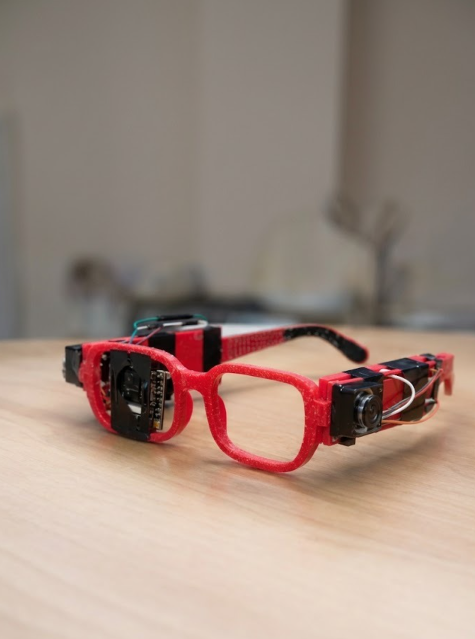
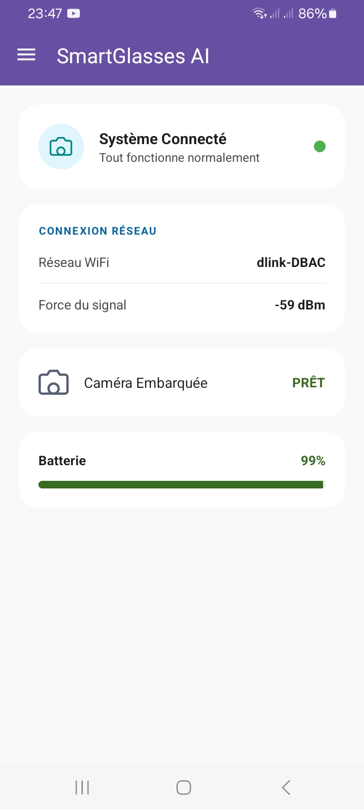
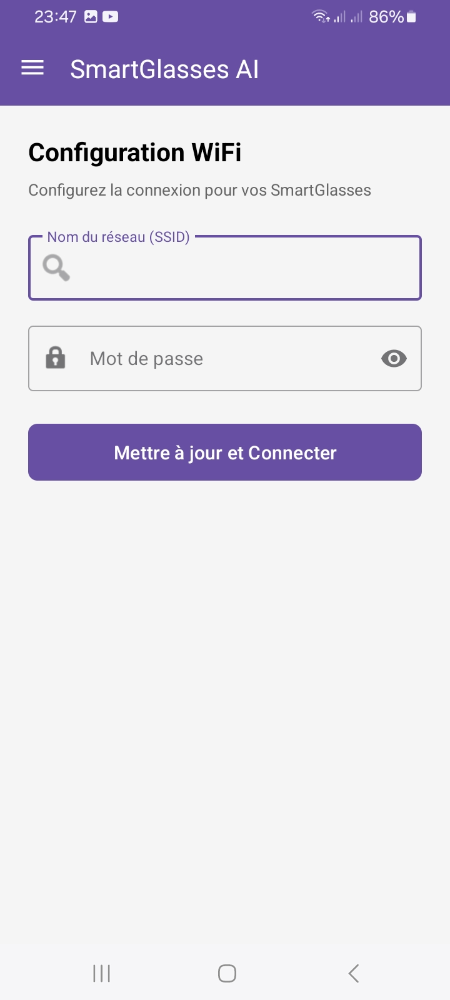
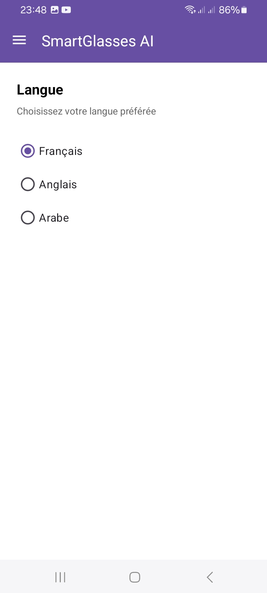

# SmartGlasses AI

Smart glasses system for visually impaired users, built on an AI microservices architecture. An ESP32-CAM camera captures images of the surroundings, which are analyzed in real time by specialized AI services (obstacle detection, text reading, Moroccan banknote recognition), and the results are sent back to an Android application via WebSocket.



## Architecture

```
ESP32-CAM ──HTTP──> API Gateway (FastAPI) ──┬──> Obstacle Service (YOLOv8)
                          │                  ├──> OCR Service (Tesseract/EasyOCR)
                          │                  └──> Money Service (YOLOv8)
                          │
                          └──WebSocket──> Android Application
```

Each AI service is an independent Docker container, exposed via an internal REST API. The API Gateway routes requests according to the requested mode (`obstacle`, `ocr`, `money`) and streams results in real time to connected clients via WebSocket.

## Services

| Service | Port | Role | Model |
|---|---|---|---|
| **api-gateway** | 8000 | Single entry point, routing, WebSocket | FastAPI |
| **obstacle-service** | 8001 | Obstacle detection and distances | YOLOv8 |
| **ocr-service** | 8002 | Text reading (FR/AR/ES/Tifinagh) | Tesseract + EasyOCR + Groq/Gemini fallback |
| **money-service** | 8003 | Moroccan banknote/coin recognition | YOLOv8 |

A **Portainer** service is included for container monitoring.

## Key Features

- **Dynamic routing** of images based on analysis mode (`/analyze?mode=obstacle|ocr|money`)
- **Real-time streaming** of results to the Android app via WebSocket (`/ws/resultats`)
- **Multilingual OCR** with automatic language detection (French, Arabic, Spanish) and text-to-speech adapted for visually impaired users
- **Tifinagh/Amazigh support** with fallback to a vision model (Gemini) when the script is not recognized by the main model
- **Rate limiting and context memory** for OCR, to improve consistency across successive readings
- **ESP32 connection status** exposed via `/glasses/status`
- **Integrated model training** via dedicated containers (`obstacle-trainer`, `ocr-trainer`, `money-trainer`)

## Android Application

| Home Screen | WiFi Configuration | Language Selection |
|---|---|---|
|  |  |  |

## Quick Start

### Prerequisites

- Docker & Docker Compose
- A `.env` file at the project root (see [Configuration](#configuration))

### Run in development

```bash
docker compose --profile dev up --build
```

### Run in production

```bash
docker compose --profile production up --build -d
```

### Run a training job (e.g. obstacle)

```bash
docker compose --profile training run obstacle-trainer
```

## Configuration

Create a `.env` file at the project root (**never commit it**):

```env
OBSTACLE_URL=http://obstacle-service:8001
OCR_URL=http://ocr-service:8002
MONEY_URL=http://money-service:8003

GROQ_API_KEY=your_groq_api_key
GEMINI_API_KEY=your_gemini_api_key

EPOCHS=50
BATCH_SIZE=16
IMG_SIZE=640
```

> **Security**: the `.env` file must always be added to `.gitignore`. If API keys are leaked, regenerate them immediately from the Groq/Google AI Studio consoles.

## Main Endpoints (API Gateway)

| Method | Route | Description |
|---|---|---|
| `GET` | `/` | General API information |
| `GET` | `/health` | Checks the status of connected services |
| `GET` | `/glasses/status` | ESP32-CAM connection status |
| `POST` | `/analyze?mode=obstacle\|ocr\|money` | Sends an image for analysis |
| `WS` | `/ws/resultats` | Real-time result stream to the Android app |

## Tests

```bash
cd obstacle-service
pytest tests/
```

## Tech Stack

- **Backend**: FastAPI, httpx, Uvicorn
- **Vision**: YOLOv8 (Ultralytics), OpenCV
- **OCR**: Tesseract (fra/ara/eng + custom Tifinagh model), EasyOCR, Groq (Llama 4 Scout) + Gemini fallback
- **Infra**: Docker Compose (`dev`, `production`, `training` profiles), Portainer
- **Hardware**: ESP32-CAM
- **Client**: Android application (Kotlin, Gradle) connected via WebSocket

## Project Structure

```
Projet_PI/
├── android-app/                 # Android application (WebSocket client)
├── api-gateway/
│   ├── tests/
│   ├── Dockerfile
│   ├── main.py
│   ├── router.py
│   ├── schemas.py
│   └── requirements.txt
├── obstacle-service/
│   ├── app/
│   │   ├── build/
│   │   └── src/
│   ├── build/
│   ├── datasets/
│   ├── models/
│   └── main.py
├── money-service/
│   ├── models/
│   ├── tests/
│   ├── trainer/
│   │   ├── classifier.py
│   │   └── Dockerfile
│   └── main.py
├── ocr-service/
│   ├── groq_service.py
│   ├── trainer/
│   │   └── train_tesseract.py
│   └── tessdata/
├── docker-compose.yml
└── .env (not versioned)
```
